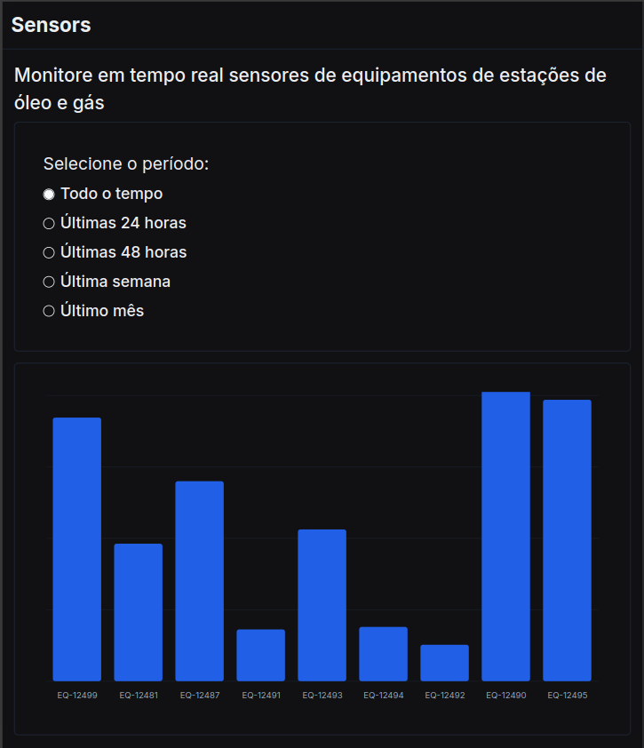

# Monitor de sensores de equipamentos de estações de óleo e gas

## Tabela de Conteúdos

- [1. Visão Geral](#1-visão-geral)
- [2. Como rodar o projeto](#2-como-rodar-o-projeto)

---

<p align="center">

</p>

## 1. Visão Geral

Este projeto é o front-end que consome a api de registro e leitura de sensores de equipamentos de estações de óleo e gás, cujo repositório se encontra <a href="https://github.com/zaquinn/oil_and_gas_sensors_registering_api" target="_blank">aqui</a>.

Tecnologias utilizadas:

- [Typescript](https://www.typescriptlang.org/)
- [React](https://react.dev/)
- [NextJs](https://nextjs.org/)
- [Docker](https://www.docker.com/)
- [TailwindCSS](https://tailwindcss.com/)
- [Shadcn/UI](https://ui.shadcn.com/)

---

## 2. Como rodar o projeto

Você pode rodar o projeto com o comando:

```bash
docker build -t nextjs-app . && docker run -p 3000:3000 nextjs-app
```

É necessário possuir o <a href="https://www.docker.com/" target="_blank">Docker</a> instalado na sua máquina.

[ Voltar para o topo ](#tabela-de-conteúdos)
